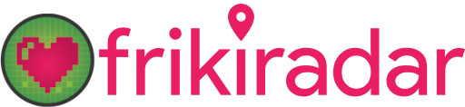
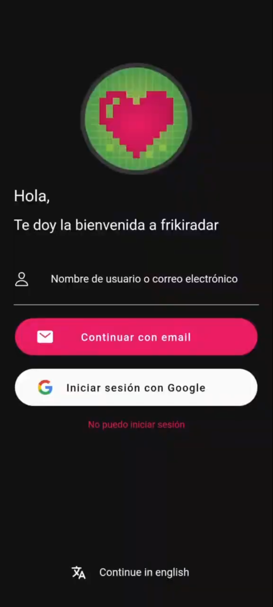
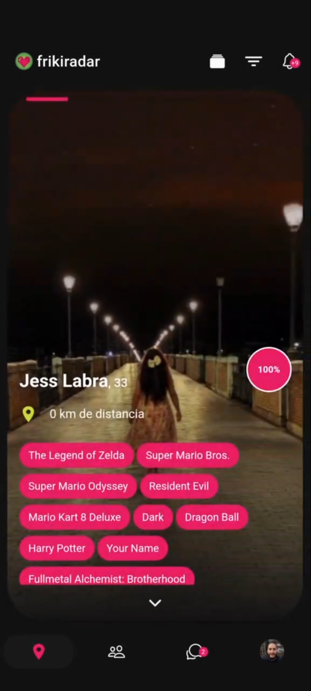
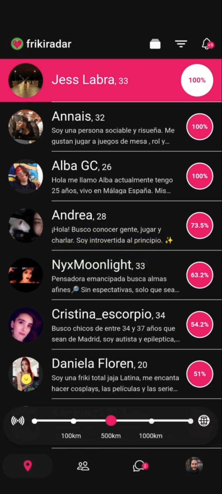
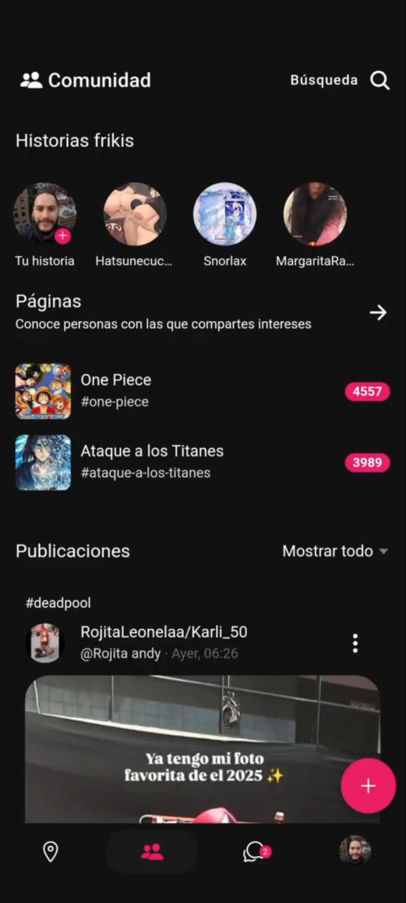

# Frikiradar Frontend
Proyecto histórico, actualmente sin soporte activo. Este repositorio se conserva solo como referencia y consulta.

## ¿Qué es Frikiradar?
Frontend de la plataforma Frikiradar, encargado de gestionar la experiencia de usuario en la web y en dispositivos móviles. Permitía a los usuarios descubrir eventos, comunidades y publicaciones relacionadas con el mundo friki, así como interactuar y compartir contenido. Además, disponía de chat corriendo en tiempo real mediante Node.js y socket.io, autenticación con Google, internacionalización (i18n), notificaciones push y seguridad avanzada con JWT.

## Principales funcionalidades
- Descubrimiento de eventos y comunidades
- Publicación y gestión de posts
- Chat y mensajería
- Notificaciones push
- Perfil de usuario y edición
- Búsqueda avanzada
- Integración con mapas y localización
- PWA: instalación en dispositivos móviles

## Tecnologías utilizadas
 - Angular
 - Ionic
 - Capacitor
 - Firebase
 - Node.js y socket.io (chat realtime)
 - SCSS
 - TypeScript
 - Conexión con backend por API REST
 - Autenticación con Google
 - Internacionalización (i18n)
 - Seguridad con JWT y manejo de errores

## Historia
Frikiradar estuvo activo como plataforma social y app móvil entre diciembre de 2017 y marzo de 2025. El frontend gestionaba la experiencia de usuario en web y dispositivos móviles.

## Logotipo y capturas de pantalla
La web corporativa estuvo en frikiradar.com y la aplicación PWA en frikiradar.app (ya no disponible). También se lanzó en Android y iOS.

### Logotipo

### Capturas de pantalla

     

El proyecto integraba tecnología PWA y notificaciones push, permitiendo instalación en dispositivos y experiencia mejorada en móviles.

## Contacto
Alberto Oishii (albertooishii@gmail.com)
Este proyecto es solo para consulta y aprendizaje. No se permite su uso comercial ni productivo.
